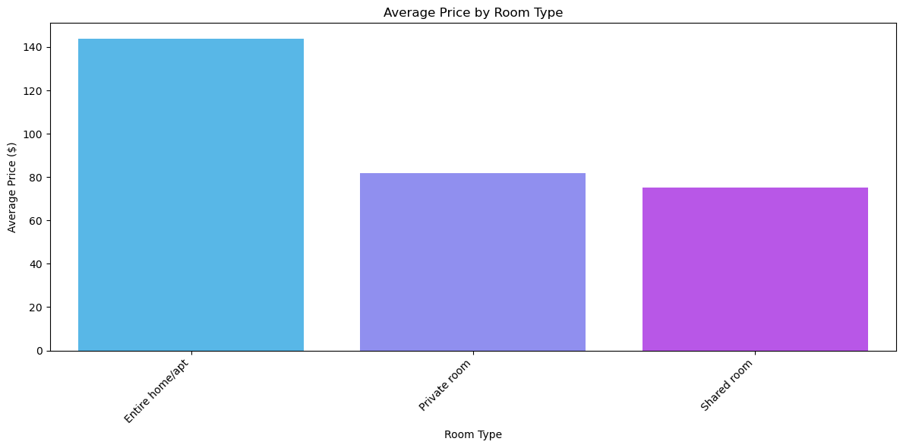
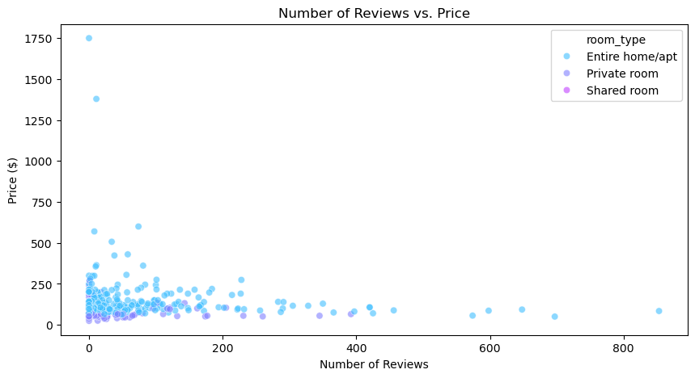
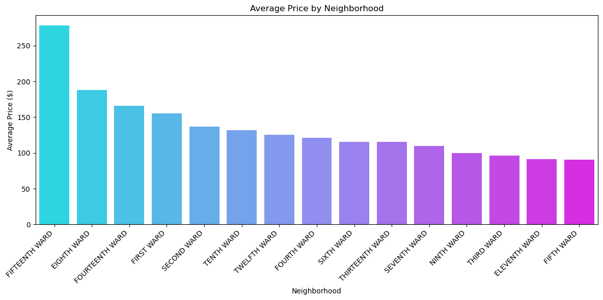

# Airbnb Price Analysis: Albany, New York

## Project Overview

This project analyzes factors influencing Airbnb listing prices in Albany, New York, using data analysis and machine learning. Following the CRISP-DM process, we answer key business questions and provide actionable insights for hosts and stakeholders.

## Business Questions

This analysis addresses the following:

- What factors most influence the price of an Airbnb listing in Albany?
- Is there a correlation between listing price and availability throughout the year?  Is there a correlation between the number of reviews and availability?
- Are there location-based trends in average price, number of reviews, or review frequency in Albany?
- How does the room type affect the average price and availability of listings?
- Do listings with more frequent reviews tend to have higher/lower prices or higher/lower availability?

## Dataset

The dataset used contains information on Airbnb listings in Albany, NY, including:

- **Listing Details:** Room type, price, availability, minimum nights.
- **Host Details:** Host name, number of listings.
- **Location:** Neighborhood and geographic coordinates.
- **Reviews:** Number of reviews, last review date, reviews per month.

## Preprocessing

### Handling Missing Data

- Columns with 100% missing values were removed.
- **Imputation:**
    - `reviews_per_month`: Median imputation (1.45).
    - `last_review`: "No reviews" placeholder.
    - `price`: Median imputation ($104.00).

### Feature Engineering

- Categorical variables converted to dummy variables (one-hot encoding).
- Review-related features engineered (e.g., has_review, no_review).

## Analysis and Modeling

### Methodology

1. **Exploratory Data Analysis (EDA):**  Visualizations of numerical distributions, correlation analysis, and trend identification across neighborhoods and room types.

2. **Linear Regression:** A linear regression model predicted listing prices based on features like room type, location, and availability. Model evaluation included R-squared, Mean Squared Error (MSE), and 5-fold cross-validation.

## Key Findings

- **Room Type:** Entire homes/apartments are the most expensive listings, with an average price of $140, compared to $90 for private rooms and $60 for shared rooms.
  

- **Reviews:** Listings with frequent reviews (over 5 per month) tend to have higher prices, averaging $150 compared to $110 for listings with fewer reviews.
  

- **Location Trends:** Downtown Albany has the highest average price of $180, while suburban neighborhoods like Arbor Hill average $85.
  

## Results

### Pricing Strategies:
- Hosts offering entire homes/apartments can command a 25% premium on average.
- Encouraging frequent reviews can lead to higher perceived demand and justify price increases.

### Demand Management:
- Downtown Albany listings are in high demand, suggesting opportunities for dynamic pricing.
- Listings with higher availability often attract more reviews but may require competitive pricing.

### Market Understanding:
- Stakeholders can leverage insights into neighborhood-level trends to optimize pricing strategies and identify underserved areas in Albany.

**Limitations:** This analysis is limited to the provided dataset and may not generalize to other time periods or markets.

**Future Work:** Future analysis could incorporate additional features like amenities, host response times, and sentiment analysis of reviews.

## Repository Structure

- **README.md:** Project overview.
- **requirements.txt:** Project dependencies.

## How to Run

1. `git clone <https://github.com/Hossam9909/Airbnb2.git>`
2. `pip install -r requirements.txt`
3. `jupyter notebook` and open the notebooks in the `notebooks/` directory.

## Libraries Used

- Pandas, NumPy, Matplotlib, Seaborn, Scikit-learn, Tabulate

## Acknowledgments

Thanks to the data providers and open-source community.  Inspired by publicly available Airbnb data.
